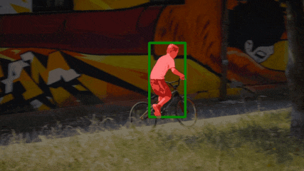

# OSTrack-SAM

This project combines OSTrack and SAM to do video object segmentation.

OSTrack:https://github.com/botaoye/OSTrack

SAM:https://github.com/facebookresearch/segment-anything

## Install the environment

```shell
conda create -n ostrack python=3.8
conda activate ostrack
bash install.sh
python tracking/create_default_local_file.py --workspace_dir . --data_dir ./data --save_dir ./output
```

## Preparation

Download pre-trained weights for OSTrack and SAM, for example, `OSTrack_ep0300.pth.tar` and `sam_vit_h_4b8939.pth`.

Put `OSTrack_ep0300.pth.tar` in `./output/checkpoints/train/ostrack/vitb_384_mae_ce_32x4_ep300`.

Set the path of images in `./tracking/samdemo.py` line 36.

Set the path of SAM weight in `./lib/test/evaluation/tracker.py` line 74.

## Running

```shell
python  ./tracking/samdemo.py ostrack
```

This project has two modes to get the initial box, input `b` for box mode, `p` for point mode.

### Box Mode

In box mode, you can draw a rectangle as the initial box, and press `Enter` to start video object segmentation.

### Point Mode

In point mode, you can click on the image to set points and get the initial box, there are two kinds of points (You can read SAM project for more details):

- Positive points: left mouse button.
- Negitive points: ctrl + left mouse button.

Press `r` to reset all points and press `f` to start video object segmentation.

## Results

The result should be as follows:



More results:


